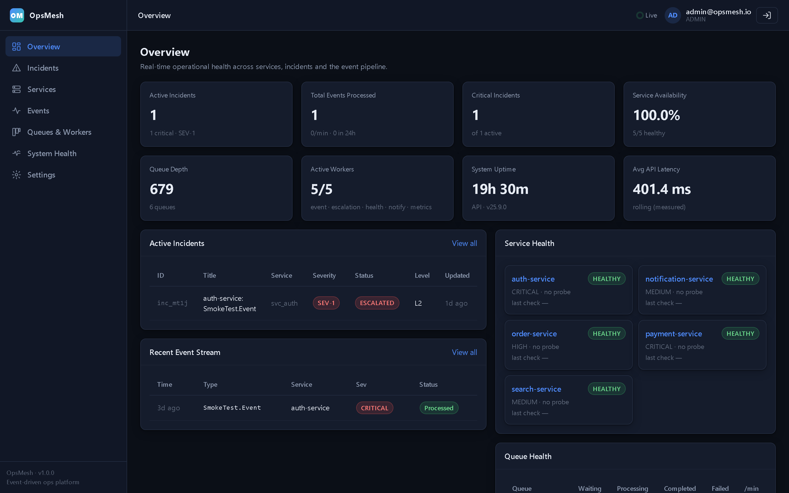
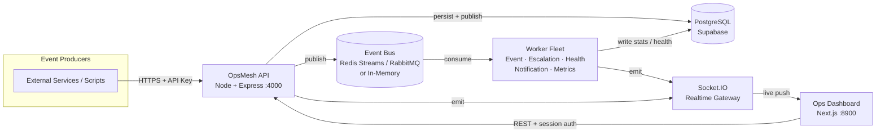
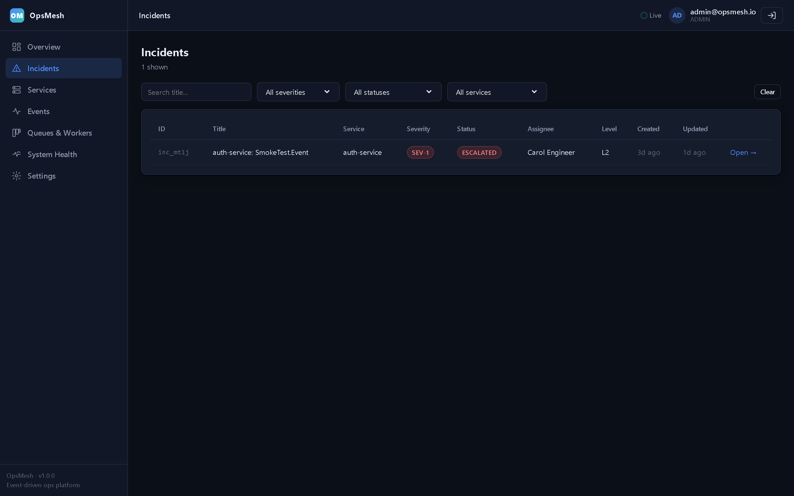
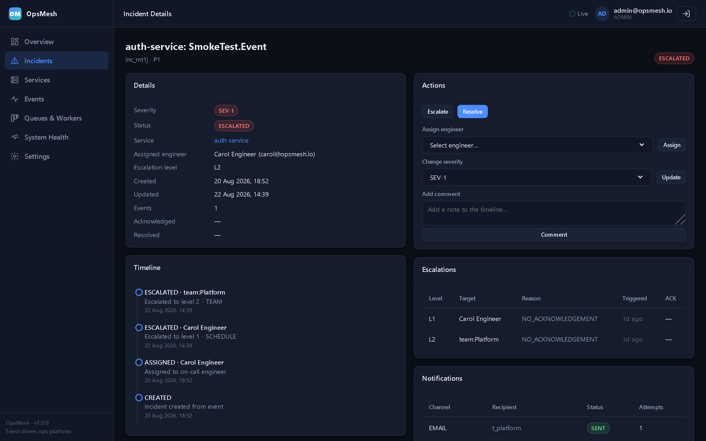
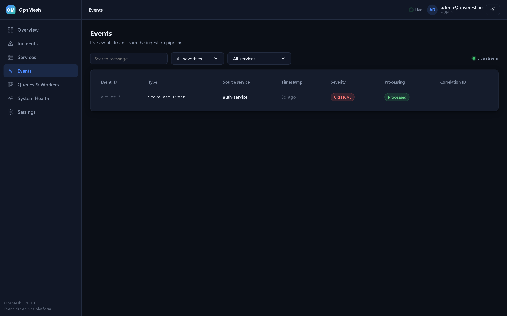
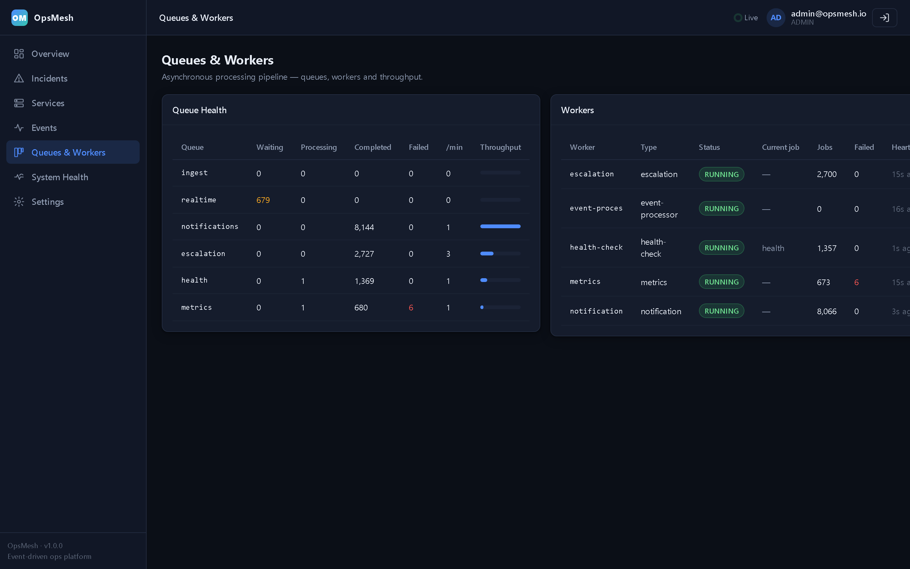
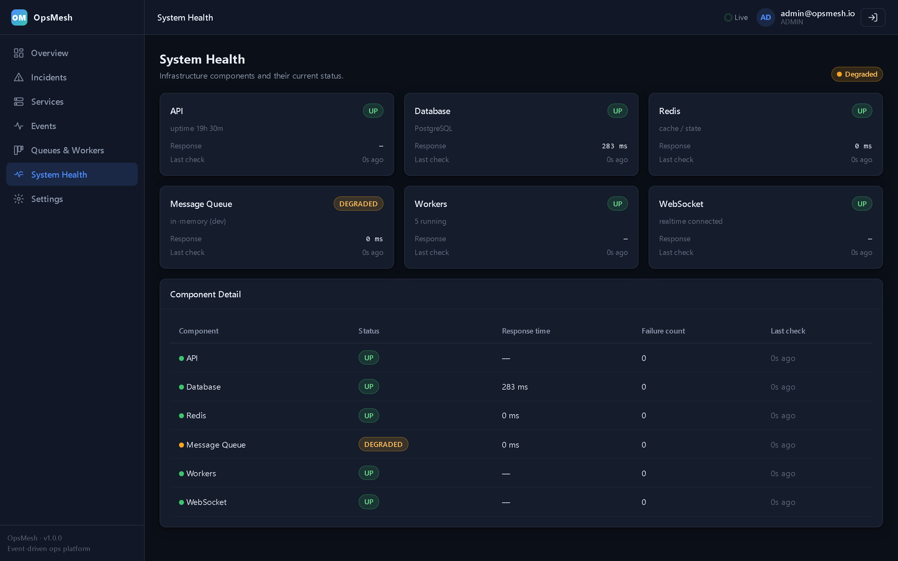
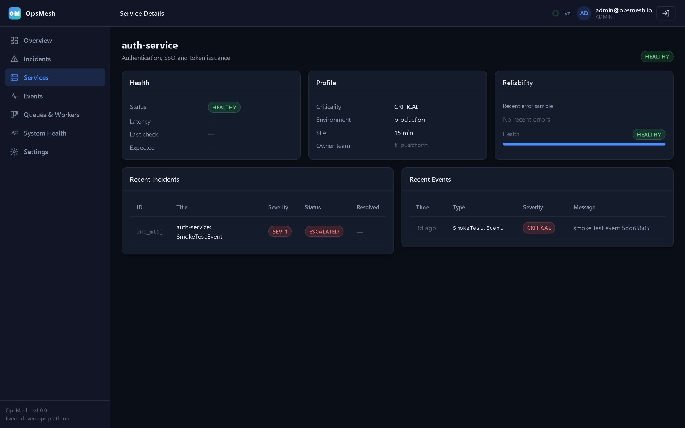
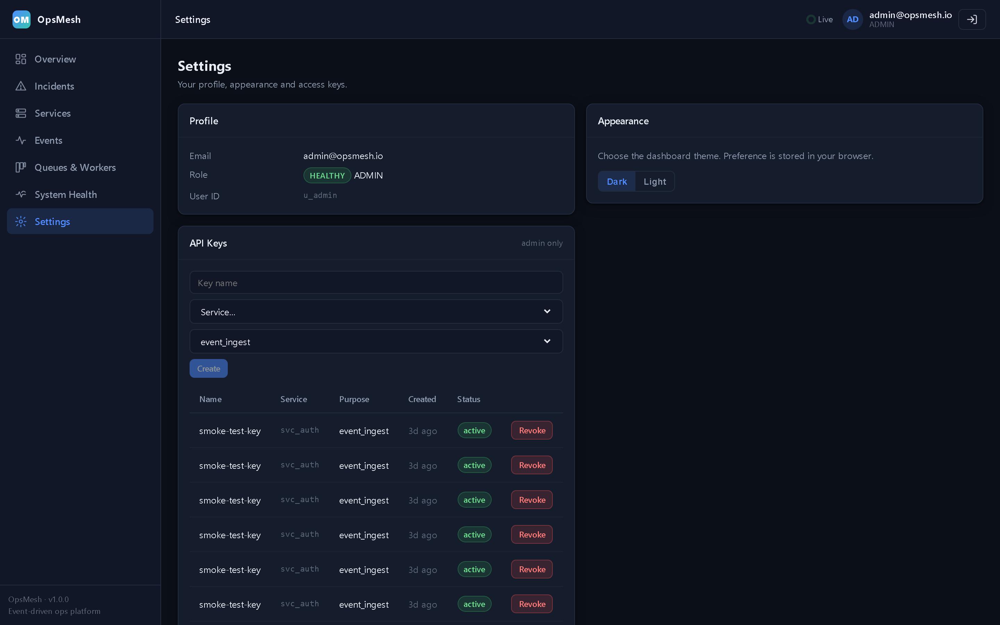
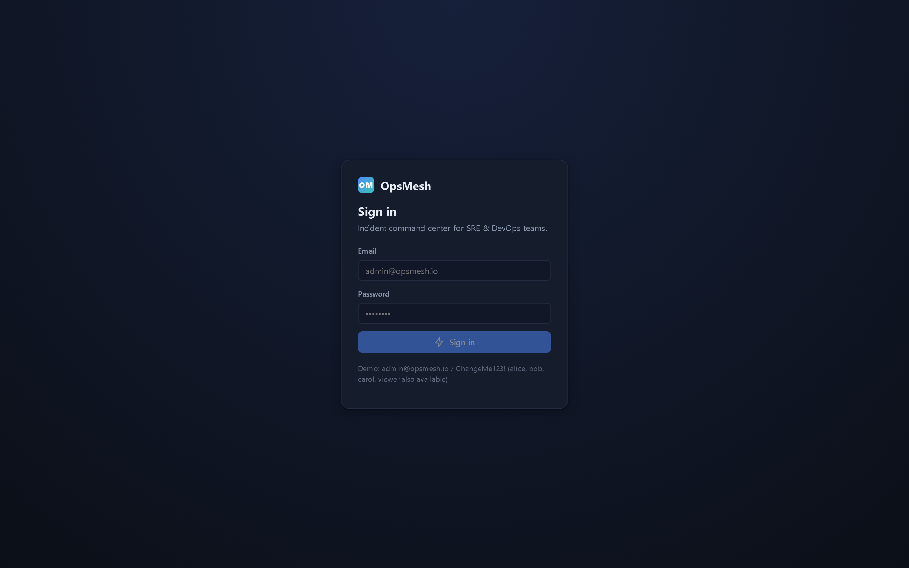

<p align="center">
  
</p>

<h1 align="center">OpsMesh</h1>

<p align="center">
  <b>Engineering Operations &amp; Incident Command Platform</b><br/>
  A real-time, event-driven control plane for incidents, services, event ingestion,
  asynchronous processing, and system observability.
</p>

<p align="center">
  
  
  
  
  
  
  
</p>

---

## Table of Contents

- [Overview](#overview)
- [Why OpsMesh](#why-opsmesh)
- [Key Capabilities](#key-capabilities)
- [Architecture](#architecture)
- [Technology Stack](#technology-stack)
- [Screenshots](#screenshots)
- [Getting Started](#getting-started)
- [Project Structure](#project-structure)
- [API Reference](#api-reference)
- [Realtime Events](#realtime-events)
- [Configuration](#configuration)
- [Database &amp; Migrations](#database--migrations)
- [Testing](#testing)
- [Roadmap](#roadmap)
- [Contributing](#contributing)
- [License](#license)

---

## Overview

**OpsMesh** is a self-contained, production-style platform that gives engineering
and SRE teams a single, real-time surface for operating distributed systems. It
ingests events through a secure, API-key–authenticated gateway, persists them, and
fans them out across an asynchronous worker fleet that drives incident lifecycle
management, escalation, health checks, notifications, and metrics — all while
streaming live state to a polished operations dashboard over WebSockets.

The system is built as a **monorepo of small, single-responsibility services**
that communicate through a pluggable event bus (Redis Streams or RabbitMQ, with a
fully functional in-memory transport for local development). This keeps the
architecture honest: the same code paths run in `memory` mode on a laptop and in
`broker` mode in production.

---

## Why OpsMesh

Most incident tooling is either (a) a thin wrapper over a ticketing system, or
(b) an observability dashboard with no operational workflow. OpsMesh sits in the
middle:

- **Event-first.** Every signal — a deploy, an error, a health check, a manual
  report — is an *event* that flows through one pipeline.
- **Asynchronous by design.** Heavy work (enrichment, escalation, notification,
  metrics) is performed by dedicated workers, so the API stays fast and the
  platform scales horizontally.
- **Real-time operations.** Dashboards are not polled; they are *pushed* updates
  via Socket.IO, so operators see state change the moment it happens.
- **Secure ingestion.** External producers authenticate with scoped **API keys**,
  while human operators use session-cookie authentication. The two planes are
  cleanly separated.
- **Runs anywhere.** In-memory transports mean you can `npm install` and go with
  zero infrastructure; the same build runs on Docker Compose with Redis + RabbitMQ.

---

## Key Capabilities

**Incident Management**
- Create, acknowledge, escalate, resolve, and reopen incidents.
- Severity classification (SEV-1 … SEV-5), assignments, and a full, audited
  timeline of every state transition and comment.
- Incident ↔ event correlation for root-cause context.

**Service & Reliability**
- Service registry with live health rollups.
- Scheduled health checks executed by the worker fleet, with deep health
  breakdown (process, API, database, worker, realtime, event bus).
- Service-level incident and event history.

**Event Pipeline**
- Secure ingestion endpoint protected by API keys.
- Live event stream with severity and status, filterable in the UI.
- Events are published to the bus and consumed by the event processor worker.

**Asynchronous Processing (Queues &amp; Workers)**
- Visible worker fleet: type, status, jobs processed, failures, heartbeats.
- Per-queue depth, processing, completed, and failure counters with a
  rolling throughput rate.
- Broker-agnostic: Redis / RabbitMQ / in-memory.

**Observability &amp; Health**
- Readiness (`/health/ready`) and liveness (`/health/live`) endpoints suitable
  for container orchestration.
- Deep health with latencies for every dependency.
- Overview widgets: active incidents, events processed, service availability,
  queue depth, worker status, uptime, and measured API latency.

**Administration**
- Role-based access (ADMIN / ENGINEER / VIEWER).
- API-key management (create / revoke) for programmatic ingestion.
- User profile and appearance (light / dark) settings.

---

## Architecture



**Data flow, end to end**

1. A producer sends an event to `POST /api/v1/events` with an API key.
2. The API validates the key, persists the event, and publishes it to the bus.
3. The **event processor** worker consumes the event, emits a
   `event.ingested` realtime message, and (when severity warrants) seeds an
   incident.
4. **Escalation**, **health-check**, **notification**, and **metrics** workers
   run on their own cadences, writing counters and heartbeats to PostgreSQL.
5. Every meaningful state change is pushed over Socket.IO, so the dashboard
   updates instantly without polling.

---

## Technology Stack

| Layer        | Technology                                                   |
|--------------|--------------------------------------------------------------|
| API          | Node.js, TypeScript, Express, Socket.IO                       |
| Workers      | Node.js, TypeScript, `tsx` (watch), shared event bus          |
| Dashboard    | Next.js 14 (App Router), React 18, TypeScript, Socket.IO client |
| Database     | PostgreSQL (Supabase), SQL migrations + seed                  |
| Messaging    | Redis Streams **or** RabbitMQ (in-memory transport for dev)   |
| Infra        | Docker Compose (API, Worker, Dashboard, Postgres, Redis, RabbitMQ) |
| Shared code  | `@opsmesh/shared`, `@opsmesh/infra`, `@opsmesh/database` (workspaces) |
| Auth         | Session cookies (operators) + scoped API keys (producers)     |

---

## Screenshots

<p align="center">
  
  
</p>
<p align="center">
  
  
</p>
<p align="center">
  
  
</p>
<p align="center">
  
  
</p>
<p align="center">
  
  
</p>

---

## Getting Started

### Prerequisites

- **Node.js** ≥ 18
- **npm** ≥ 9 (workspaces)
- A **PostgreSQL** database (a free [Supabase](https://supabase.com) project works
  out of the box) — or run one locally / via Docker.
- *(Optional, production)* Redis and RabbitMQ — both are replaced by an
  in-memory transport in development.

### Option A — Docker Compose (recommended for a full stack)

```bash
cp .env.example .env            # fill in DATABASE_URL, JWT_SECRET, etc.
docker compose -f infrastructure/docker/docker-compose.yml up --build
```

This brings up Postgres, Redis, RabbitMQ, the API, the Worker, and the Dashboard.

### Option B — Local development

```bash
# 1. Install workspace dependencies
npm install

# 2. Configure environment
cp .env.example .env
#    Edit .env and set DATABASE_URL, JWT_SECRET, and (for dev) REDIS_URL=memory,
#    RABBITMQ_URL=memory, NODE_ENV=development, CORS_ORIGINS=http://localhost:8900

# 3. Create the schema and seed demo data
npm run db:migrate
npm run db:seed

# 4. Start the three processes (each in its own terminal, or via the bat files)
npm run dev:api       # http://localhost:4000
npm run dev:worker    # background processing
npm run dev --workspace=apps/dashboard   # http://localhost:8900
```

> The API, Worker, and Dashboard each read a `.env` from their own workspace
> folder, so copy `.env` into `apps/api`, `apps/worker`, and `apps/dashboard`
> (or rely on the repo-root `.env` if your tooling resolves it).

### First sign-in

A demo dataset is seeded. Sign in with:

```
email:    admin@opsmesh.io
password: ChangeMe123!
```

> **Rotate these credentials before any non-local deployment.**

---

## Project Structure

```
ops-mesh/
├── apps/
│   ├── api/            # Express + Socket.IO API and all domain modules
│   │   └── src/modules # auth, incidents, events, services, metrics,
│   │                   # escalation, notifications, audit, health, on-call,
│   │                   # teams, api-keys, system
│   ├── worker/         # Event-driven worker fleet (tsx)
│   │   └── src/modules # event-processor, escalation, health-check,
│   │                   # notification, metrics
│   └── dashboard/      # Next.js 14 operations UI (port 8900)
├── packages/
│   ├── shared/         # Types, schemas, API contracts
│   ├── infra/          # Redis client, event bus, transport abstractions
│   └── database/       # SQL migrations + seed + db runner
├── infrastructure/
│   └── docker/         # Docker Compose for the full stack
└── docs/
    └── screenshots/    # Product screenshots used in this README
```

---

## API Reference

All human-facing endpoints require an authenticated session cookie; ingestion
endpoints require a valid API key.

| Method | Path                                      | Auth        | Purpose                              |
|--------|-------------------------------------------|-------------|--------------------------------------|
| POST   | `/api/v1/auth/login`                      | Public      | Operator login (session cookie)       |
| POST   | `/api/v1/events`                          | API key     | Ingest an event                      |
| GET    | `/api/v1/events`                          | Session     | List / filter events                 |
| GET    | `/api/v1/incidents`                       | Session     | List incidents (paginated)           |
| POST   | `/api/v1/incidents/:id/acknowledge`       | Session     | Acknowledge an incident              |
| PATCH  | `/api/v1/incidents/:id/status`            | Session     | Resolve / change status              |
| POST   | `/api/v1/incidents/:id/severity`          | Session     | Update severity                      |
| POST   | `/api/v1/incidents/:id/assign`            | Session     | Assign an owner                      |
| POST   | `/api/v1/incidents/:id/reopen`            | Session     | Reopen a resolved incident           |
| GET    | `/api/v1/services`                        | Session     | Service registry                     |
| GET    | `/api/v1/metrics/dashboard`               | Session     | Overview KPIs                        |
| GET    | `/api/v1/system/queues`                   | Session     | Queue depth / throughput             |
| GET    | `/api/v1/system/workers`                  | Session     | Worker fleet status                  |
| GET    | `/api/v1/api-keys`                        | ADMIN       | List API keys                        |
| POST   | `/api/v1/api-keys`                        | ADMIN       | Create an API key                    |
| GET    | `/health/ready` · `/health/live`          | Public      | Orchestrator health probes           |

---

## Realtime Events

The API and workers emit the following events over Socket.IO. The dashboard
subscribes and updates live.

| Event                    | Emitted when…                                  |
|--------------------------|------------------------------------------------|
| `incident.created`       | A new incident is opened                        |
| `incident.updated`       | Any incident state change (status, severity…)   |
| `event.ingested`         | An event is processed by the worker fleet       |
| `notification.dispatched`| A notification is sent                          |
| `service.health`         | A service health rollup changes                 |
| `metrics.refresh`        | Aggregated metrics are recomputed               |

---

## Configuration

| Variable               | Description                                                      |
|------------------------|------------------------------------------------------------------|
| `DATABASE_URL`         | PostgreSQL connection string (URL-encode password special chars)  |
| `DATABASE_SSL`         | `true` for managed Postgres (e.g., Supabase)                      |
| `JWT_SECRET`           | Secret used to sign session tokens (≥ 16 chars)                  |
| `COOKIE_SECURE`        | `true` in production (HTTPS); leave unset on `http://localhost`   |
| `REDIS_URL`            | `redis://…` or `memory` (dev)                                    |
| `RABBITMQ_URL`         | `amqp://…` or `memory` (dev)                                     |
| `CORS_ORIGINS`         | Comma-separated allowed dashboard origins                        |
| `PORT`                 | API port (default `4000`)                                        |
| `NEXT_PUBLIC_API_URL`  | Dashboard → API base URL (default `http://localhost:4000`)       |

See `.env.example` for the full, annotated template.

---

## Database &amp; Migrations

Schema is versioned as ordered SQL under `packages/database`:

| Migration | Contents                                                  |
|-----------|-----------------------------------------------------------|
| `001`     | Core schema: incidents, events, services, users, teams…    |
| `002`     | API-key management                                         |
| `003`     | Health-check results                                       |
| `004`     | Worker & queue statistics (`worker_stats`, `queue_stats`)  |

```bash
npm run db:migrate   # apply pending migrations
npm run db:seed      # load demo dataset (users, services, sample incident)
```

---

## Testing

```bash
npm run test:unit        # unit tests across workspaces
npm run test:integration # integration tests
npm run test:e2e         # end-to-end (Playwright)
npm run typecheck        # TypeScript across workspaces
npm run lint             # ESLint across workspaces
```

---

## Roadmap

- [ ] Multi-region / multi-tenant isolation
- [ ] Slack &amp; PagerDuty notification channels (beyond SMTP/Webhook)
- [ ] SLO tracking and error-budget burn-down
- [ ] Runbook automation attached to incidents
- [ ] Historical analytics &amp; trend exports
- [ ] OpenTelemetry trace ingestion

---

## Contributing

1. Fork and create a feature branch.
2. Keep modules single-responsibility; expose reusable types via
   `@opsmesh/shared`.
3. Add tests for new behavior and keep `npm run typecheck` green.
4. Open a pull request with a clear description and screenshots where relevant.

---

## License

Released under the [MIT License](LICENSE).
